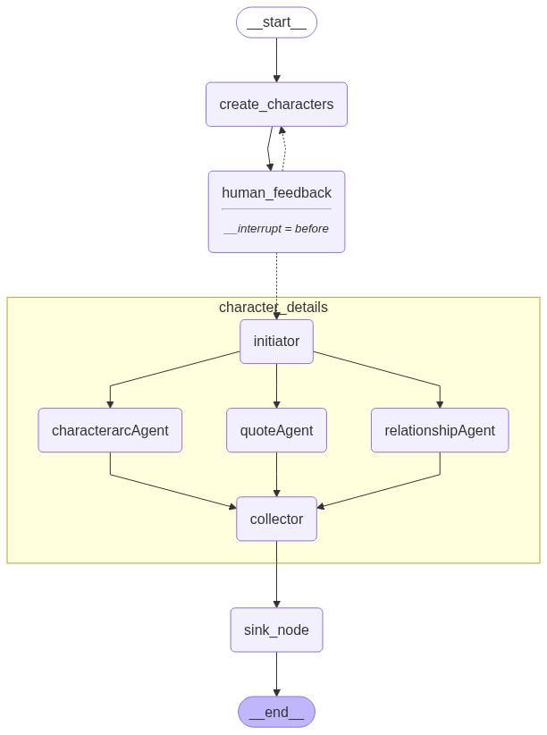

# Character Details Agent

This project builds an agent that extracts detailed information about the characters in a book. It uses [LangGraph](https://github.com/langchain-ai/langgraph) to orchestrate a series of language model prompts, Pinecone for retrieval, and an EPUB preprocessing pipeline.



## Overview

1. **Preprocessing (`preprocess.py`)**
   - Reads an EPUB file and splits it into chapters.
   - Summarises each chapter with OpenAI's API.
   - Chunks the text and uploads embeddings to a Pinecone index.
   - Generates `chapter_details.json` with chapter texts and summaries.

2. **Graph Execution (`main.py`)**
   - Loads the summaries and builds a LangGraph `CharacterMakerGraph`.
   - Generates candidate characters and optionally accepts human feedback.
   - For each character, subgraphs extract quotes, relationships and arc entries from the book.
   - Produces `final_characters.json` containing a rich profile for each character.

3. **Post-processing (`postprocess.py`)**
   - Converts the final character JSON file to a CSV, assigning a UUID to each record.

## Requirements

- Python 3.9+
- OpenAI API key
- Pinecone API key
- Packages listed in `pyproject.toml`/`uv.lock`

### Installing Dependencies
The project uses a standard `pyproject.toml`. You can install with `pip` or any PEP‑517 compatible tool:

```bash
pip install -r <(python -m pip install --dry-run . | awk '/Downloading/ {print $2}')
```

Or simply:

```bash
pip install -e .
```

## Running
1. **Prepare an EPUB file** and place it under `books/files/`. Adjust the path in `main.py` if necessary.
2. Set the following environment variables:
   - `OPENAI_API_KEY`
   - `PINECONE_API_KEY`

3. Run the preprocessing step:

```bash
python preprocess.py
```

4. Execute the interactive character generation loop:

```bash
python main.py
```

This draws the graph to `character_maker_graph.png` and prompts for optional feedback while characters are generated. The resulting information is written to `books/<book-title>/final_characters.json`.

5. (Optional) Convert the output to CSV:

```bash
python postprocess.py
```

## Repository Structure

```
README.md            This file
main.py              Entry point coordinating the workflow
preprocess.py        EPUB preprocessing & Pinecone upload
postprocess.py       Convert results to CSV
graphs.py            LangGraph definitions
nodes.py             Individual node logic
states.py            State dictionaries for passing data between nodes
models.py            Pydantic models used in prompts and responses
prompts.py           Prompt templates
models_init.py       LLM and embedding initialisation
pyproject.toml       Dependency definitions
uv.lock              Locked dependency versions
character_maker_graph.png  Example graph visualisation
```

## Notes
- The `books/` directory is git‑ignored and stores generated data.
- `models.py` currently contains duplicate `Character` class definitions; the later definition overrides the earlier one.

## Learning More
- [LangChain](https://python.langchain.com/) and [LangGraph](https://github.com/langchain-ai/langgraph) documentation
- [Pinecone](https://www.pinecone.io/) for vector search
- [Pydantic](https://docs.pydantic.dev/) for typed data models

